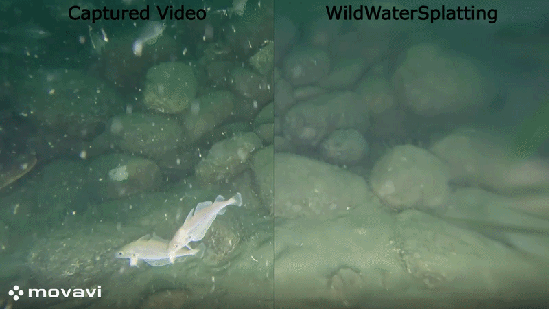

<h1 align="center">
    <span class="title-main">WildWaterSplatting</span><br>
    <span class="title-small">Occluder-Masking Underwater Gaussian Splatting</span>
</h1>

<br>

<p align="center">
  
</p>

<p align="justify">
    This repository introduces WildWaterSplatting, a Gaussian Splatting method that combines underwater lighting dynamics modelling and occluder masking with an auxiliary model. WildWaterSplatting is built on top of WaterSplatting with the addition of a U-Net masking model from the method Gaussians in the Wild. Through this combination, WildWaterSplatting shows improved reconstruction of highly dynamic scenes containing large quantities of moving marine animals and marine snow.
</p>

<br>

## Installation

This method is built on WaterSplatting; therefore, all setup instructions are the same. This repository is a fork of the original WaterSplatting repository:

https://github.com/water-splatting/water-splatting

### Create environment
```bash
conda create --name wild_water_splatting -y python=3.8
conda activate wild_water_splatting
python -m pip install --upgrade pip
```

### Install WildWaterSplatting

```bash
# Install PyTorch
pip uninstall torch torchvision functorch tinycudann
pip install torch==2.1.2+cu118 torchvision==0.16.2+cu118 --extra-index-url https://download.pytorch.org/whl/cu118

# Install cuda-toolkit with conda
conda install -c "nvidia/label/cuda-11.8.0" cuda-toolkit

# Install tiny-cuda-nn
pip install ninja git+https://github.com/NVlabs/tiny-cuda-nn/#subdirectory=bindings/torch

# Install nerfstudio
pip install nerfstudio==1.1.4
ns-install-cli

# WaterSplatting
git clone git@github.com:VojiWest/wild-water-splatting.git
cd water-splatting
git submodule init
git submodule update --recursive
pip install --no-use-pep517 -e .
```

## Training
To start the training run the following commands:
```bash
cd /your_path_to_repo/wild-water-splatting
ns-train wild-water-splatting --vis viewer+wandb colmap --downscale-factor 1 --colmap-path sparse --data /your_path_to_dataset --images-path images
```

### Additional Arguments

In addition to the arguments provided by the original [WaterSplatting](https://github.com/water-splatting/water-splatting) implementation, WildWaterSplatting introduces the following arguments for occluder masking:

| Argument | Default | Description |
|---|---:|---|
| `use_features_mask` | `True` | Enables the occluder masking model when set to `True`. |
| `map_generator_type` | `"unet"` | Specifies the masking model architecture. Currently, only a U-Net is implemented. |
| `features_mask_loss_coef` | `0.75` | Weight applied to the occluder mask loss. A value of `0.75` was found to provide the best results in our experiments. |
| `features_mask_iters` | `2500` | Number of initial iterations during which only the Gaussian Splatting model and IFM MLP are trained, without the U-Net masking model. |
| `init_mask_train_iters` | `2000` | Number of iterations for which only the occluder masking model is trained after `features_mask_iters`. |
| `seperated_learning` | `True` | When set to `True`, the occluder masking model and WaterSplatting model are updated separately during training. |

 

## Evaluation

```bash
cd /your_path_to_repo/wild-water-splatting
ns-eval --load-config outputs/unnamed/water-splatting/your_timestamp/config.yml --render-output-path renders/eval
```

